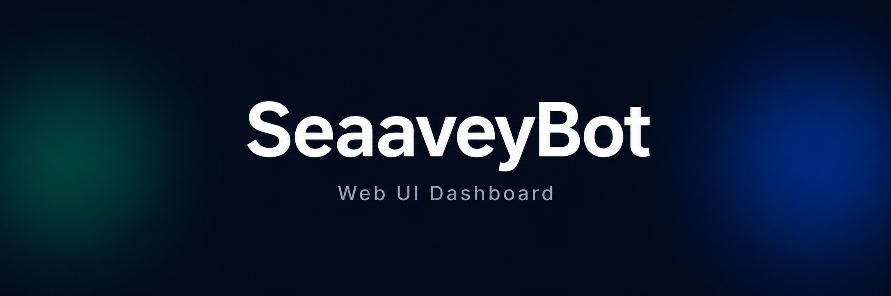

# SeaaveyBot Web UI



Dashboard web untuk mengelola SeaaveyBot — WhatsApp Bot Framework.

## Tech Stack

- **Framework:** Nuxt 4
- **UI Components:** shadcn-vue (Reka UI)
- **Styling:** Tailwind CSS v4
- **Table:** TanStack Vue Table
- **Icons:** Lucide Vue Next
- **Runtime:** Bun

## Features

- Dashboard dengan statistik bot, chart usage, dan activity feed
- Manajemen Groups (edit, mute/unmute, anti-spam, welcome message)
- Manajemen Users (edit, ban/unban, view details)
- Manajemen Commands (edit, enable/disable, filter by category)
- Logs viewer dengan level filter
- Broadcast & Schedules
- Settings (general config, tunneling via Cloudflare/Tailscale)
- Dark/Light mode
- Responsive layout

## Getting Started

```bash
# Install dependencies
bun install

# Development
bun run dev

# Build
bun run build

# Preview production build
bun run preview
```

## Project Structure

```
app/
├── assets/css/        # Tailwind CSS
├── components/
│   ├── icons/         # Custom SVG icon components
│   └── ui/            # shadcn-vue components
├── composables/       # Mock data & shared logic
├── layouts/           # Default layout with sidebar & topbar
├── lib/               # Utilities
├── pages/             # Route pages
└── plugins/           # Nuxt plugins
```

## License

MIT
